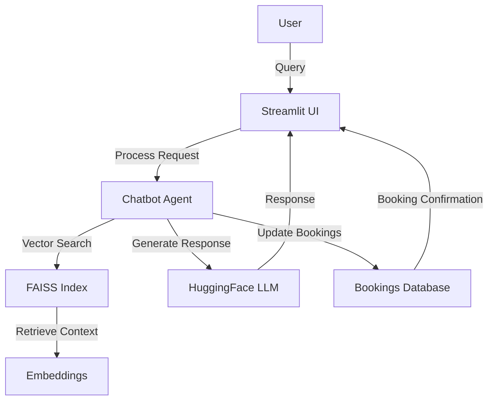

# ☕ Qahwa Coffee Chatbot

<div align="center">
  
  
  [](https://streamlit.io/)
  [](https://www.python.org/)
  [](https://huggingface.co/)
</div>

## 🌟 Overview

Qahwa Coffee Chatbot is an intelligent virtual assistant designed to help customers explore and purchase premium Arabic coffee. Built with modern AI technologies, it provides personalized recommendations, product information, and handles workshop bookings through an elegant, user-friendly interface.

## 🚀 Features

- **Interactive Chat Interface**: Natural language conversations about coffee products
- **Product Catalog**: Browse and learn about premium Arabic coffee varieties
- **Workshop Booking**: Reserve spots for coffee brewing workshops
- **Responsive Design**: Beautiful UI that works on all devices
- **AI-Powered**: Advanced language understanding for accurate responses

## 🛠️ Tech Stack

### Backend
- **Python 3.9+**: Core programming language
- **Streamlit**: Web application framework
- **LangChain**: Framework for developing applications with LLMs
- **Hugging Face**: For embeddings and language models
- **FAISS**: Efficient similarity search

### Frontend
- **Streamlit**: For building the web interface
- **HTML/CSS**: For custom styling and layout within Streamlit

## 🚀 Getting Started

### Prerequisites

- Python 3.9 or higher
- pip (Python package manager)
- Git (for cloning the repository)

### Installation

1. **Clone the repository**
   ```bash
   git clone https://github.com/yourusername/qahwa-chatbot.git
   cd qahwa-chatbot
   ```

2. **Create and activate a virtual environment**
   ```bash
   # Windows
   python -m venv my
   .\my\Scripts\activate
   
   # macOS/Linux
   python3 -m venv my
   source my/bin/activate
   ```

3. **Install dependencies**
   ```bash
   pip install -r requirements.txt
   ```

4. **Set up environment variables**
   Create a `.env` file in the root directory and add your Hugging Face API token:
   ```
   HUGGINGFACE_API_TOKEN=your_huggingface_token_here
   ```

### Running the Application

1. **Start the Streamlit app**
   ```bash
   streamlit run app/app.py
   ```

2. **Access the application**
   Open your browser and navigate to `http://localhost:8501`

## 🤖 Using the Application

### Chatbot Features

#### Product Information
- "What types of coffee do you offer?"
- "Tell me about your Yemeni Mokha blend"
- "What are the different package sizes available?"

### Workshop Booking

1. **Book a Workshop Slot**
   - Navigate to the workshop booking section
   - Select your preferred date and time slot
   - Provide your contact information
   - Submit the booking form

2. **Email Confirmation**
   - After successful booking, you'll receive a confirmation email from `info.qahwacoffee@gmail.com`
   - The email will include:
     - Workshop details (date, time, location)
     - What to bring
     - Payment instructions (if applicable)
     - Contact information for any queries

3. **Reminder**
   - A reminder email will be sent 24 hours before your scheduled workshop

## 🏗️ Project Structure

```
qahwa-chatbot/
├── app/                    # Main application code
│   └── app.py             # Streamlit application
├── img/                   # Image assets
│   ├── qahwalogo.png
│   ├── hero3.png
│   ├── hero2.png
│   └── hero-coffee.webp
├── scripts/
│   └── agent.py          # Chatbot logic and AI integration
├── data/                  # Data files
│   ├── catalog.csv        # Product catalog
│   ├── bookingslist.csv   # Workshop bookings
│   ├── Qahwa Info.pdf     # Detailed product information (PDF)
│   └── Qahwa Info.docx    # Detailed product information (Word)
├── utils/                 # Utility functions
│   └── emails.py         # Email handling utilities
├── requirements.txt       # Python dependencies
└── README.md             # This file
```

## 🧩 Architecture




## 📝 License

This project is licensed under the MIT License - see the [LICENSE](LICENSE) file for details.

## 🙏 Acknowledgments

- [Streamlit](https://streamlit.io/) for the amazing web framework
- [Hugging Face](https://huggingface.co/) for the language models
- The open-source community for various libraries and tools

## 📧 Contact

For questions or feedback, please contact [harshini.k.aiyyer@gmail.com](mailto:your-email@gmail.com)

---

<div align="center">
  Made with ❤️ & ☕ by Harshini
</div>
